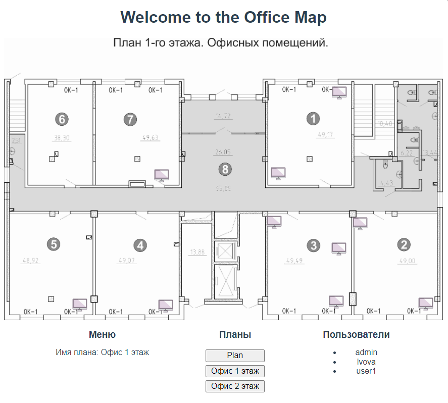

# Карта офиса (Frontend)

## Запуск бекенд
Инструкция по установке https://github.com/esolder/office_map

## Установка зависимостей и запуск приложения
1. Перейдите в папку frontend в корневой директории проекта.
2. Установите зависимости:
```
npm install
```
3. Запустите приложение:
```
npm run serve
```
Приложение будет доступно по адресу http://localhost:5173 (или другому порту, если указано в файле .env).

## Использование
1. Запустите браузер и перейдите по адресу, где запущено приложение (по умолчанию http://localhost:5173).
2. В панели администратора Django (localhost:8000/admin/), создайте суперпользователя:
```
python manage.py createsuperuser
```
3. Войдите в панель администратора, создайте план помещения, указав его наименование и загрузив изображение карты.
4. Вернитесь на главную страницу приложения и начните использовать интерактивную карту офиса:

* Просматривайте различные планы помещений.
* Добавляйте новые рабочие места сотрудников, дважды кликнув по желаемой области на карте.
* Выбирайте другие планы помещений из списка.
* Удаляйте рабочее место одним кликом по выбранному месту.
* Увеличивайте/уменьшайте масштаб окна (иконки рабочих мест останутся привязаны к плану)
